# MC Studio Helper 插件食用指北

**环境要求：** PyCharm 2025.1 及以上版本  
**断点调试额外要求：** ModPC 开发包 3.7.0.222545 及以上版本 + LSP4IJ 插件（随本插件自动安装）

---

## 一、插件安装

前往 **PyCharm 插件市场**，搜索 `MC Studio Helper` 并安装：


安装完成后重启 PyCharm 即可。本插件会自动捆绑安装 **LSP4IJ** 插件，该插件用于后续的断点调试功能。

---

## 二、添加运行配置

1. 打开你的开发项目，点击右上角 **Debug 按钮旁的更多操作按钮**，进入配置管理界面：

   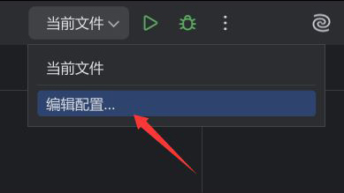

2. 点击左上角的 **＋** 按钮，添加一个新的运行配置（该选项位置较靠下，需要向下滚动查找）：

   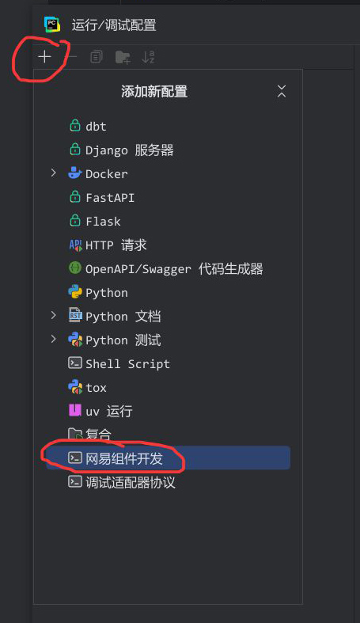

3. 根据提示填写相应的配置信息：

   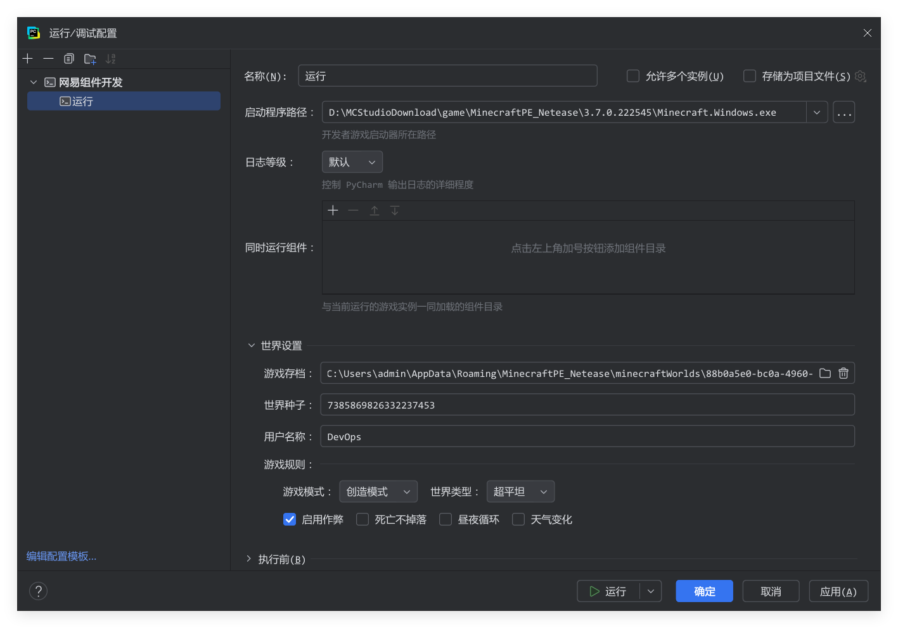

---

## 三、运行

完成配置后，点击运行按钮即可启动游戏。游戏正常启动的同时，会打开日志输出界面：

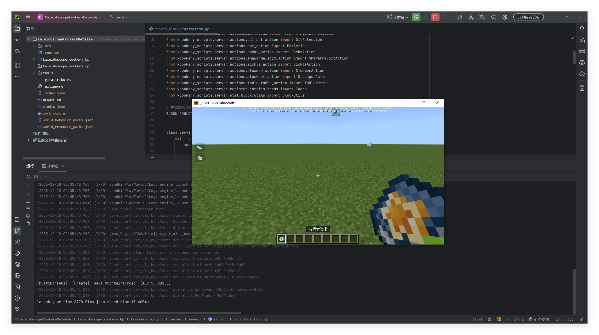

### 常用操作

| 操作 | 快捷键 / 方式 |
| :-: | :-: |
| 热重载脚本 | 切换回游戏后按 **R** 键 |
| 重载整个存档 | 按小键盘 **0** 键 |
| 跳转到错误代码 | 点击错误日志中的文件链接，PyCharm 自动跳转 |

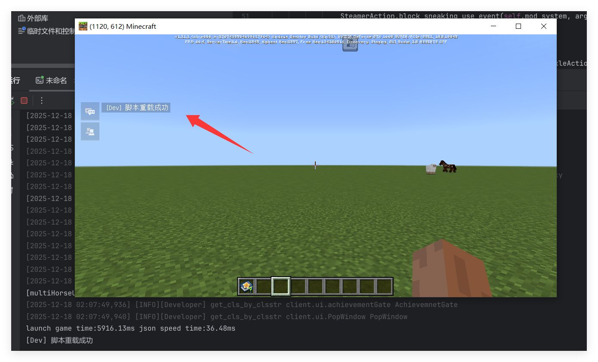


---

## 四、断点调试

> 由于 PyCharm 对 DAP（Debug Adapter Protocol）调试协议的原生支持有限，此部分配置稍显复杂，请按步骤操作。

### 4.1 前置检查

在使用断点调试之前，请确保满足以下条件：

1. 使用 **3.7.0.222545** 及以上版本的 ModPC 开发包
2. 已通过 PyCharm **成功运行过游戏**
3. 在日志开头能看到如下提示信息：

   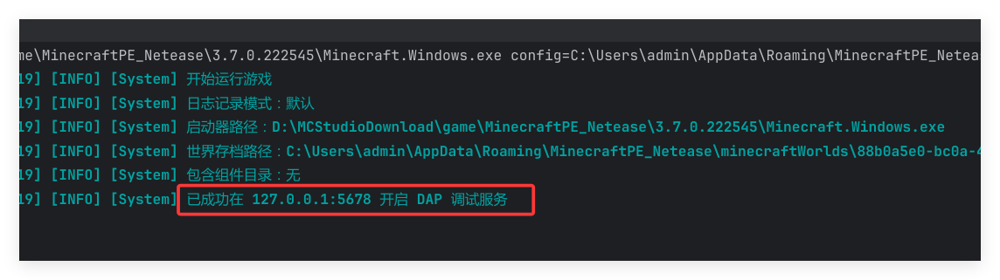

### 4.2 创建调试配置

1. 再次进入运行配置界面，新增一个 **调试适配器协议** 类型的运行配置，然后点击序号 ③ 处的 `创建新服务器`：

   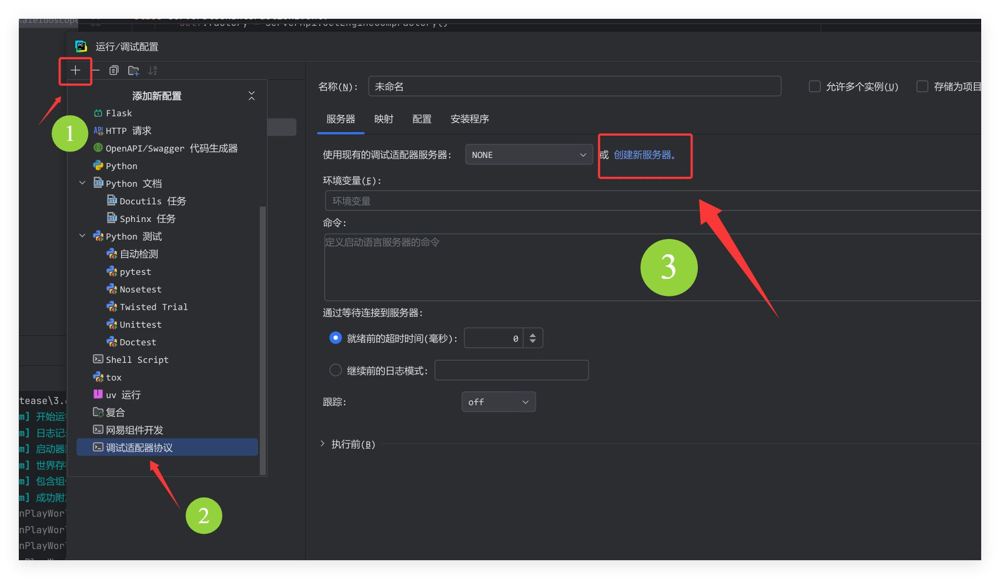

2. 在打开的页面中，点击 `选择模板`，添加一个 **Python** 模板：

   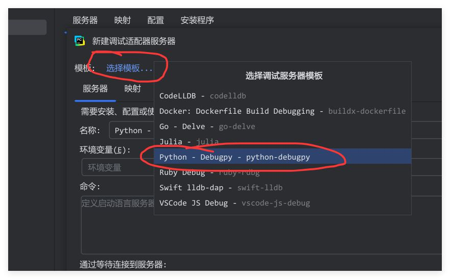

3. 进入配置页面后，确保以下设置正确：

   | 配置项 | 值 |
   | :-: | :-: |
   | 调试模式 | 附加 |
   | 地址 | `127.0.0.1` |
   | 端口号 | `5678` |

   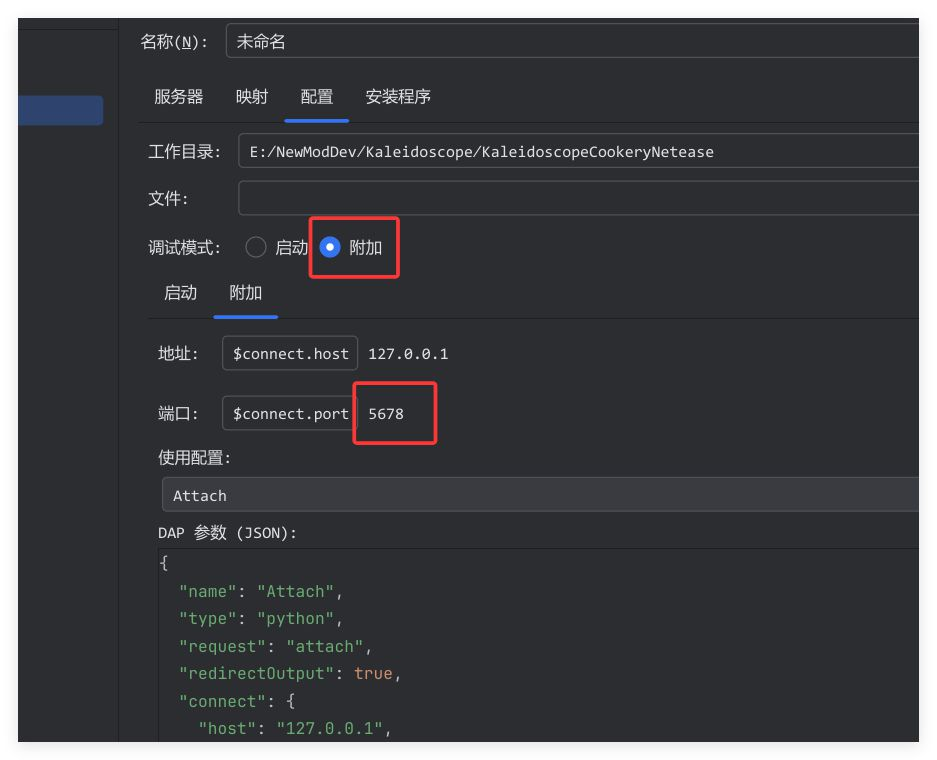

4. **DAP 参数（JSON）** 填写如下内容：

```json
{
  "name": "Attach",
  "type": "python",
  "request": "attach",
  "redirectOutput": true,
  "connect": {
    "host": "127.0.0.1",
    "port": 5678
  },
  "pathMappings": [
    {
      "localRoot": "${workspaceFolder}",
      "remoteRoot": "${workspaceFolder}"
    }
  ],
  "debugOptions": [
    "ShowSpecialMembers",
    "ShowPrivateMembers",
    "ShowFunctionMembers",
    "ShowBuiltinMembers"
  ]
}
```

### 4.3 启动调试

保存配置后，务必以 **调试模式（Debug）** 运行该配置。

> **提示：** 首次运行时会自动下载必要的前置库，请耐心等待。

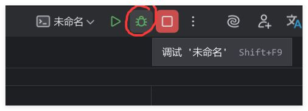

当调试窗口自动跳转到如下界面时，说明调试程序已成功连接到游戏：

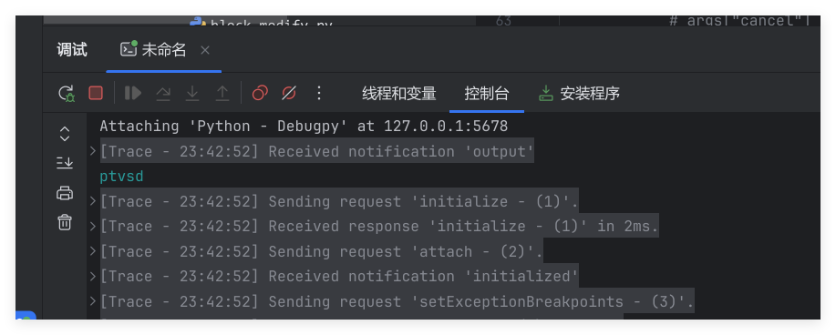

### 4.4 设置断点

在 PyCharm 中设置断点需要 **点击两次**：

1. 第一次点击行号左侧的空白处
2. 第二次点击行内，断点才会生效

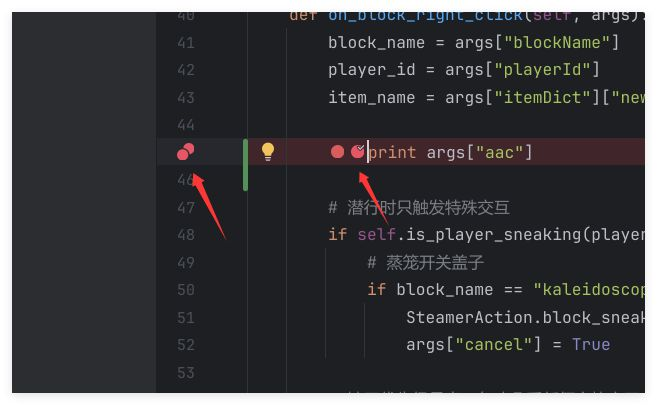

一切就绪，现在可以愉快地进行断点调试了 🎉

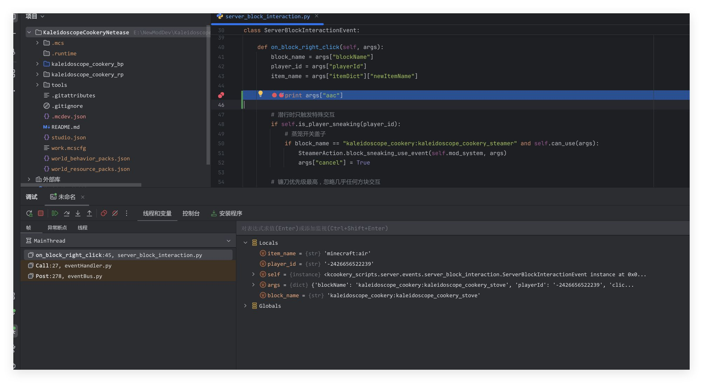

**快捷键提示：** 按 **F9** 可以继续运行程序。

